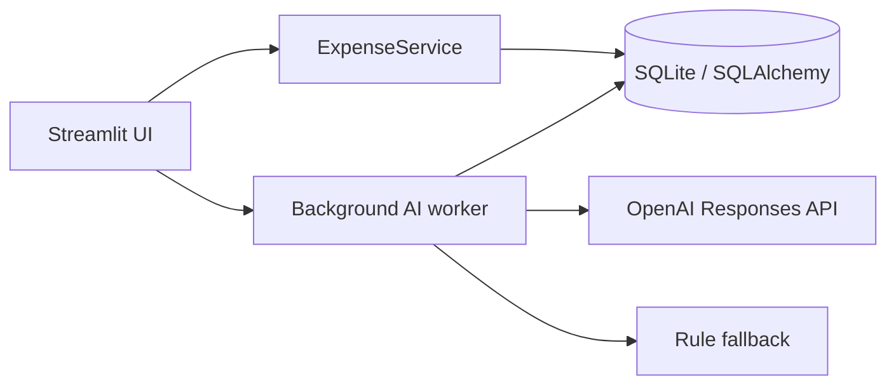

# ExpenseFlow — Expense Approval MVP

ExpenseFlow is an English-language, role-based expense approval demo built with Python and
Streamlit. Employees submit USD reimbursement claims, the system routes each category to its
configured approver, and approvers receive an advisory AI consistency check before making the
final decision.

**Live demo:** [sag7-expense-approval.streamlit.app](https://sag7-expense-approval.streamlit.app/)

The AI never approves, rejects, or blocks a claim. If OpenAI is slow, unavailable, or not
configured, the app immediately remains usable and labels its deterministic fallback clearly.

## What is included

- Employee and approver roles; one user can hold both roles.
- Five routed expense categories.
- `pending`, `approved`, `rejected`, and `withdrawn` workflows.
- Mandatory rejection comments and owner-only withdrawal.
- Object-level access checks in the service layer, not just UI filtering.
- Two-second live refresh for employee status and approver queues.
- OpenAI Responses API integration with structured output.
- Rule-based fallback and cached assessments.
- Fictional seed data, reset control, migrations, tests, and CI.

## Run locally

Requirements: Python 3.12.

```bash
python3.12 -m venv .venv
source .venv/bin/activate
pip install -r requirements-dev.txt
streamlit run app.py
```

The app creates `data/expense_approval.sqlite3`, applies the Alembic migration, and loads the
demo dataset automatically. No API key is required to run the app; without one, the AI panel is
explicitly labeled as a rule-based fallback.

To enable OpenAI analysis:

```bash
cp .streamlit/secrets.example.toml .streamlit/secrets.toml
```

Then add `OPENAI_API_KEY` to `.streamlit/secrets.toml`. The default model is `gpt-5-mini` and can
be changed with `OPENAI_MODEL`. The real secrets file is ignored by Git.

## Demo accounts

All demo accounts use password `Demo123!`.

| Account | Roles | Assigned categories |
|---|---|---|
| `employee@expense-demo.local` | Employee | — |
| `approver@expense-demo.local` | Approver | Office, Travel, Software/Subscriptions |
| `dual@expense-demo.local` | Employee + Approver | Client Entertainment, Other |
| `second.employee@expense-demo.local` | Employee | — |

Passwords are stored only as Argon2 hashes. The login shortcuts intentionally expose the shared
password because every account and claim is fictional and the deployment is a public test demo.

## Five-minute review script

1. Sign in as `employee@expense-demo.local`. Open **My claims** and verify all four statuses.
2. Confirm that the second employee's printer-toner claim is not visible.
3. Submit a new Office expense, then open a second private browser window.
4. Sign in there as `approver@expense-demo.local`; the claim appears within two seconds.
5. Open the seeded `$780.00` Office claim describing a London flight. The AI or labeled fallback
   flags the category mismatch while both decision buttons remain active.
6. Try Reject without a comment, then reject with a reason. The employee view updates within two
   seconds.
7. Sign in as `dual@expense-demo.local` and switch between both workspaces. Self-approval is
   intentionally allowed for this MVP, as specified in the implementation brief.
8. Sign out, expand **Reset demo data**, confirm, and restore the initial dataset.

## Architecture



- `app.py` contains the Streamlit composition, session identity, live fragments, and background
  AI job coordination.
- `src/expense_approval/services.py` is the authorization and workflow boundary. Every read and
  mutation checks the acting user again.
- `src/expense_approval/ai.py` builds the only payload sent externally:
  `amount_usd`, `category`, `description`, and `expense_date`. Payment details and user identity
  are excluded.
- SQLAlchemy stores money as integer cents and Alembic owns the schema.
- SQLite runs in WAL mode with a five-second busy timeout. Status decisions use an atomic
  conditional update, so a stale second decision cannot overwrite the first.

### State transitions

```text
pending ──approve──> approved
pending ──reject───> rejected   (comment required)
pending ──withdraw─> withdrawn  (claim owner only)
```

Resolved claims cannot transition again.

### AI behavior

When an assigned approver opens a claim, a background worker asks the OpenAI Responses API for:

```json
{
  "summary": "One or two short sentences",
  "is_inconsistent": false,
  "reasons": []
}
```

The request has a four-second timeout, no retries, `store=false`, and a strict Pydantic response
schema. The result is cached against a SHA-256 hash of the four allowed input fields. API errors
fall back to transparent keyword and amount checks. Neither path can mutate claim status.

## Test and quality checks

```bash
ruff check .
pytest --cov=expense_approval
```

The suite covers validation, routing, dual roles, access isolation, all transitions, mandatory
rejection comments, concurrent decisions, AI payload privacy, structured response parsing,
fallback behavior, caching, and a Streamlit login-page smoke test.

## Deploy to Streamlit Community Cloud

1. Push this repository to GitHub.
2. In [Streamlit Community Cloud](https://share.streamlit.io), create an app from the repository
   and set `app.py` as the entrypoint.
3. Select Python 3.12.
4. Add the following in the app's **Secrets** settings:

   ```toml
   OPENAI_API_KEY = "your-key"
   OPENAI_MODEL = "gpt-5-mini"
   AI_TIMEOUT_SECONDS = 4.0
   ```

5. Share the generated `streamlit.app` URL together with the repository and demo credentials.

Never commit `.streamlit/secrets.toml` or an API key.

## Deliberate MVP boundaries

- SQLite is appropriate for this reviewable demo, not for a production financial system. The
  local database may reset when a Community Cloud instance is rebuilt.
- "Live" status uses a two-second Streamlit fragment refresh, not database push subscriptions.
- Payment details are synthetic free text and are visible only to the claimant and assigned
  approver. The UI warns users not to enter real financial data.
- Registration, receipt uploads, editing submitted claims, notifications, currency conversion,
  SSO, audit exports, and production database operations are out of scope.
